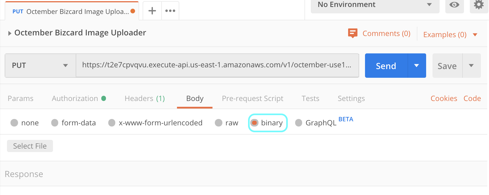

# <a name="top"></a>Octember - Social Graph Based People Recommender Using Amazon Neptune And Textract

- OCR(Optical Character Reconition) 기술을 활용한 명함 관리 및 Graph database(Neptune)을 이용한 인맥 추천 서비스

## Table of Contents
1. [Architecture](#architecture)
2. [RESTful API Specification](#restful-api-spec)
3. [Lambda Functions Overview](#lambda-fn-overview)
4. [Build & Deploy](#how-to-deploy)
5. [References & Tips](#references-tips)
6. [Limits](#limits)
7. [Demo](#demo)

### <a name="architecture"></a>Architecture


##### Key AWS Services
- API Gateway
- Lambda Function
- Kinesis Data Stream
- Kinesis Data Firehorese
- Elasticsearch Service
- ElastiCache
- DynamoDB
- Neptune (Graph database)
- Textract
- S3

\[[Top](#Top)\]

### <a name="restful-api-spec"></a>RESTful API Specification
##### Image upload
- Request
  - PUT
    ```
    - /v1/{bucket}/{object}
    ```

    | URL Path parameters | Description | Required(Yes/No) | Data Type |
    |---------------------|-------------|------------------|-----------|
    | bucket | s3 bucket 이름 | Yes | String |
    | object | s3 object 이름 | Yes | String |

  - ex) octember-use1 라는 s3 bucket의 bizcard-raw-img 디렉터리 아래에 bar_s20191101_125236.jpg 파일을 업로하는 예제
    ```
    curl -X PUT "https://t2e7cpvqvu.execute-api.us-east-1.amazonaws.com/v1/octember-use1/bizcard-raw-img%2Fbar_s20191101_125236.jpg" \
         --data @bar_s20191101_125236.jpg
    ```

- Response
  - No Data

\[[Top](#Top)\]

##### Search
- Request
  - GET
    ```
    - /v1/search?query=isv&user=foobar&limit=10
    ```

    | Key | Description | Required(Yes/No) | Data Type |
    |-----|-------------|------------------|-----------|
    | query | 검색 질의어 (name, job title, company, address) | No | String |
    | user | 검색 결과 필터링 조건 (biz card를 등록한 user id) | No | String |
    | limit | 검색 결과 개수 (기본 값: 10) | No | Integer |
    
    - (&#33;) **query** 혹은 **user** 중 하나의 값은 반드시 필요함

  - ex)
      ```
      curl -X GET "https://gfrgyj029q.execute-api.us-east-1.amazonaws.com/v1/search?query=architect&limit=2"
      ```

- Response
  - meta 데이터

    | Key | Description | Data Type |
    |-----|-------------|-----------|
    | _index | Elasticsearch Index 이름 | String |
    | _type | Elasticsearch Type 이름 | String |
    | _id | 문서 id | String |
    | _score | 검색 결과 Relevance 점수 | String |
    | _source | | JSON |

  - _source 데이터

    | Key | Description | Data Type |
    |-----|-------------|-----------|
    | doc_id | 문서 id | String |
    | name | 이름 | String |
    | phone_number | 전화 번호 | String |
    | email | email 주소 | String |
    | job_title | 회사 직함 | String |
    | company | 회사 이름 | String |
    | addr | 회사 주소 | String |
    | is_alive | 문서 삭제 여부 플래그(0: 삭제, 1: 검색 가능한 문서) | Integer |
    | owner | 명함 등록 사용자 id | String |
    | image_id | 명함 이미지 파일 이름 | String |
    | content_id | 중복 문서 제거를 위한 문서 내용 id | String |
    | created_at | 문서 생성 시간 | String |

  - ex)
    ```
    [
        {
            "_index": "octember_bizcard",
            "_type": "bizcard",
            "_id": "dfb6c487",
            "_score": 0.5619609,
            "_source": {
                "addr": "508, Nonhyeon-ro, Gangnam-gu Seoul, 06141, Rep. of KOREA",
                "email": "foo@amazon.com",
                "phone_number": "(+82 10) 2135 1294 ",
                "company": "aws",
                "name": "Foo Lee",
                "job_title": "Solutions Architect",
                "created_at": "2019-11-05T05:20:24Z",
                "doc_id": "dfb6c487",
                "image_id": "bar_s20191101_125236.jpg",
                "owner": "bar",
                "is_alive": 1,
                "content_id": "e2c266fc"
            }
        },
        {
            "_index": "octember_bizcard",
            "_type": "bizcard",
            "_id": "8a78483a",
            "_score": 0.43445712,
            "_source": {
                "addr": "12Floor GS Tower, 508 Nonhyeon-ro Gangnam-gu, Seoul, Korea",
                "email": "bar@amazon.com",
                "phone_number": "(+82 10) 7843 3795 ",
                "company": "aws",
                "name": "Bar Kim",
                "job_title": "ISV Partner Solutions Architect",
                "created_at": "2019-11-05T05:18:28Z",
                "doc_id": "8a78483a",
                "image_id": "foo_j20191101_125250.jpg",
                "owner": "foo",
                "is_alive": 1,
                "content_id": "3064ab8c"
            }
        }
    ]
    ```

\[[Top](#Top)\]

##### PYMK(People You May Know)
- Request
  - GET
    ```
    - /v1/pymk?user=foo%20bar&limit=10
    ```

    | Key | Description | Required(Yes/No) | Data Type |
    |-----|-------------|------------------|-----------|
    | user | 인맥 추천을 받고자 하는 사용자 이름 | Yes | String |
    | limit | 인맥 추천 결과 개수 (기본 값: 10) | No | Integer |

  - ex)
      ```
      curl -X GET "https://y2xmtfbduf.execute-api.us-east-1.amazonaws.com/v1/pymk?user=foo%20bar&limit=2"
      ```

- Response
  - body 데이터

    | Key | Description | Data Type |
    |-----|-------------|-----------|
    | name | 이름 | String |
    | phone_number | 전화 번호 | String |
    | email | email 주소 | String |
    | job_title | 회사 직함 | String |
    | company | 회사 이름 | String |
    | score | 인맥 추천 점수 | Float |

  - ex)
    ```
    [
        {
            "name": [
                "Bar Lee"
            ],
            "phone_number": [
                "(+82 10) 3025 7502 "
            ],
            "company": [
                "aws"
            ],
            "job_title": [
                "Solutions Architect"
            ],
            "email": [
                "bar@amazon.com"
            ],
            "score": 4.0
        },
        {
            "name": [
                "Foo Kim"
            ],
            "phone_number": [
                "(+82 10) 7315 3970 "
            ],
            "company": [
                "aws"
            ],
            "job_title": [
                "Partner Solutions Architect"
            ],
            "email": [
                "foo@amazon.com"
            ],
            "score": 3.0
        }
    ]
    ```

\[[Top](#Top)\]

### <a name="lambda-fn-overview"></a>Lambda Functions Overview

| Name | Description | Event Source | IAM Role | VPC | Etc |
|:----:|-------------|--------------|------|-----|-----|
| TriggerTextExtractFromS3Image | biz card 이미지가 s3에 등록되면, text 데이터 추출 작업을 실행 시키는 작업 | S3 ObjectCreated Event | DynamoDB Read/Write, Kinesis Data Stream Read/Write | No VPC | ETL |
| GetTextFromS3Image | textract를 이용해서 biz card 이미지에서 text 데이터를 추출하는 작업 | Kinesis Data Stream | S3 Read/Write, DynamoDB Read/Write, Kinesis Data Stream Read/Write, Textract | | ETL |
| UpsertBizcardToES | biz card의 text 데이터를 ElasticSearch에 색인하는 작업 | Kinesis Data Stream | Kinesis Data Stream Read | | ETL |
| UpsertBizcardToGraphDB | biz card의 text 데이터를 graph database에 load 하는 작업  | Kinesis Data Stream | Kinesis Data Stream Read | | ETL |
| SearchBizcard | biz card를 검색하기 위한 검색 서버 | API Gateway | | | Proxy Server |
| RecommendBizcard | PYMK(People You May Know)를 추천해주는 서버 | API Gateway | | | Proxy Server |

\[[Top](#Top)\]

### Data Specification

##### S3에 업로드할 biz card image 파일 이름 형식
- `{user_id}_{image_id}.jpg`
  > ex) foobar_i592134.jpg
- `{user_id}` 는 octember 서비스에 가입한 회원 아이디

##### `GetTextFromS3Image` In/Output Data
- Input
  - `{"s3_bucket": "{bucket name}", "s3_key": "{object key}"}`
    > ex) `{"s3_bucket": "octember-use1", "s3_key": "bizcard-raw-img/foobar_i592134.jpg"}`
- Output
  - json data format
      ```
       {
        "s3_bucket": "{bucket name}",
        "s3_key": "{object key}",
        "owner": "{user_id}",
        "data": {
          "addr": "{address}",
          "email": "{email address}",
          "phone_number": "{phone number}",
          "company": "{company name}",
          "name": "{full name}",
          "job_title": "{job title}",
          "created_at": "{created datetime}"
         }
       }
       ```
  - ex) 
      ```
       {
        "s3_bucket": "octember-use1",
        "s3_key": "bizcard-raw-img/foobar_i592134.jpg",
        "owner": "foobar",
        "data": {
          "addr": "12Floor GS Tower, 508 Nonhyeon-ro, Gangnam-gu, Seoul 06141, Korea",
          "email": "foobar@amazon.com",
          "phone_number": "(+82 10) 1025 7049",
          "company": "aws",
          "name": "Foo Bar",
          "job_title": "Solutions Architect",
          "created_at": "2019-10-25T01:12:54Z"
         }
       }
       ```

\[[Top](#Top)\]

##### `UpsertBizcardToES` In/Output Data
- Input
  - `GetTextFromS3Image` output data 참고
- Output
  - json data format
      ```
       {
         "doc_id": "md5({image file name})",
         "image_id": "{image file name}",
         "is_alive": {0 - dead, 1 - alive(default)},
         "addr": "{address}",
         "email": "{email address}",
         "phone_number": "{phone number}",
         "company": "{company name}",
         "name": "{full name}",
         "job_title": "{job title}",
         "created_at": "{created datetime}"
       }
       ```
  - ex)
      ```
       {
         "doc_id": "21cf827e",
         "image_id": "foobar_i592134.jpg",
         "is_alive": 1,
         "addr": "12Floor GS Tower, 508 Nonhyeon-ro, Gangnam-gu, Seoul 06141, Korea",
         "email": "foobar@amazon.com",
         "phone_number": "(+82 10) 1025 7049",
         "company": "aws",
         "name": "Foo Bar",
         "job_title": "Solutions Architect",
         "created_at": "2019-10-25T01:12:54Z"
       }
       ```

\[[Top](#Top)\]

##### `UpsertBizcardToGraphDB` In/Output Data
- Input
  - `GetTextFromS3Image` output data 참고
- Output
  - Neptune Schema 참고

\[[Top](#Top)\]

##### S3 Bucket 및 Directory 구조

| Bucket | Folder | Description |
|--------|--------|-------------|
| {bucket name} | bizcard-raw-img | 사용자가 업로드한 biz card image 원본 저장소 |
| {bucket name} | bizcard-by-user/{user_id} | 업로드된 biz card image를 사용자별로 별도로 보관하는 저장소 |
| {bucket name} | bizcard-text/{YYYY}/{mm}/{dd}/{HH} | biz card image에서 추출한 text 데이터 저장소; 검색을 위한 재색인 및 배치 형태의 텍스트 분석을 위한 백업 저장소 |

\[[Top](#Top)\]

##### DynamoDB Schema

| primary key(partition key) | s3_bucket | s3_key | mts | status |
|----------------------------|-----------|--------|-----|--------|
| {user_id}_{image_id}.jpg | s3 bucket | s3 object key | last modified time(yyyymmddHHMMSS) | processing status {START, PROCESSING, END} |
| foobar_i592134.jpg | octember-use1 | bizcard-raw-img/foobar_i592134.jpg | 20191025011254 | END |

\[[Top](#Top)\]

##### Neptune Schema

- Vertex

| Vertex Label | Property | Description |
|--------------|----------|-------------|
| person | id, name, email, phone_number, job_title, company | biz card에 있는 인물 정보 |
| person | <pre>{<br/>"id": "3858f622",<br/>"name": "Foo Bar",<br/>"_name": "foo bar",<br/>"email": "foobar@amazon.com",<br/>"phone_number": "(+82 10) 1025 7049",<br/>"job_title": "Solutions Architect",<br/>"company": "aws"<br/>}</pre> | |

- Edge

| Edge Label | Property | Description |
|--------------|----------|-------------|
| knows | weight | biz card를 주고 받은 사람들 간의 관계 (weight: 관계의 중요도) |
| knows | {"weight": 1.0} | |

\[[Top](#Top)\]

### <a name="how-to-deploy"></a>How To Build & Deploy
#### (1) aws cdk를 사용하는 방법
##### Prerequisites
1. [Getting Started With the AWS CDK](https://docs.aws.amazon.com/cdk/latest/guide/getting_started.html)를 참고해서 cdk를 설치하고,
cdk를 실행할 때 사용할 IAM User를 생성한 후, `~/.aws/config`에 등록함
예를 들어서, cdk_user라는 **AdministratorAccess** 권한을 갖는 IAM User를 생성 한 후, 아래와 같이 `~/.aws/config`에 추가로 등록함

    ```shell script
    $ cat ~/.aws/config
    [profile cdk_user]
    aws_access_key_id=AKIAI44QH8DHBEXAMPLE
    aws_secret_access_key=wJalrXUtnFEMI/K7MDENG/bPxRfiCYEXAMPLEKEY
    region=us-east-1
    ```

2. Lambda Layer에 등록할 Python 패키지를 생성해서 s3 bucket에 저장함.
 예를 들어, elasticsearch, gremlinpython, redis 패키지를
Lambda Layer에 등록 할 수 있도록 octember-resources라는 이름의 s3 bucket을 생성 후, 아래와 같이 저장함.<br/>

    ```shell script
    $ aws s3 ls s3://octember-resources/var/
    2019-10-25 08:38:50          0
    2019-10-25 08:40:28    1294387 octember-es-lib.zip
    2019-10-29 08:35:28    1311836 octember-gremlinpython-lib.zip
    2019-10-30 07:41:07     141534 octember-redis-lib.zip
    ```
    **참고**: [AWS Lambda Layer에 등록할 Python 패키지 생성 예제](#aws-lambda-layer-python-packages)

3. cdk를 이용해서 Amazon ElasticSearch Service를 VPC 내에 생성하기 위해서 다음과 같이 Amazon ElasticSearch Service를 위한 **service linked role** 을 미리 생성한다.
   ```shell script
    $ aws iam create-service-linked-role --aws-service-name es.amazonaws.com
   ```

4. 소스 코드를 git에서 다운로드 받은 후, **cdk.context.json** 파일에 `lib_bucket_name` 라는 key 값으로 lambda layer에 등록할 패키지가 저장된 s3 bucket 이름을
설정 한 후, `cdk deploy` 명령어를 이용해서 배포함

    ```shell script
    $ git clone git@github.com:aws-samples/social-graph-based-people-recommender-using-amazon-neptune-and-textract.git
    $ cd octember-bizcard
    $ cat <<EOF > cdk.context.json
    > {
    >   "lib_bucket_name": "octember-resources"
    > }
    > EOF
    $ python3 -m venv .env
    $ source .env/bin/activate
    (.env) $ pip install -r requirements.txt
    (.env) $ cdk --version
    1.85.0 (build 5f44668)
    (.env) $ cdk context -j
    {
      "lib_bucket_name": "octember-resources"
    }
    (.env) $ export CDK_DEFAULT_ACCOUNT=$(aws sts get-caller-identity --query Account --output text)
    (.env) $ export CDK_DEFAULT_REGION=us-east-1
    (.env) $ cdk bootstrap aws://${CDK_DEFAULT_ACCOUNT}/${CDK_DEFAULT_REGION}
    (.env) $ cdk --profile=cdk_user synth
      Resources:
        OctemberVPC04CAC20C:
          Type: AWS::EC2::VPC
          Properties:
            CidrBlock: 10.0.0.0/16
            EnableDnsHostnames: true
            EnableDnsSupport: true
            InstanceTenancy: default

      ......

        AssetParametersa05ca8352deadc2f1972c4fb21555d99120d0510cccb81d30b285153803df7ddS3VersionKey52AC24C7:
          Type: String
          Description: S3 key for asset version "a05ca8352deadc2f1972c4fb21555d99120d0510cccb81d30b285153803df7dd"
        AssetParametersa05ca8352deadc2f1972c4fb21555d99120d0510cccb81d30b285153803df7ddArtifactHashEF43BE8F:
          Type: String
          Description: Artifact hash for asset "a05ca8352deadc2f1972c4fb21555d99120d0510cccb81d30b285153803df7dd"
        SsmParameterValueawsserviceamiamazonlinuxlatestamzn2amihvmx8664gp2C96584B6F00A464EAD1953AFF4B05118Parameter:
          Type: AWS::SSM::Parameter::Value<AWS::EC2::Image::Id>
          Default: /aws/service/ami-amazon-linux-latest/amzn2-ami-hvm-x86_64-gp2

    (.env) $ cdk --profile=cdk_user deploy
    ```
    :white_check_mark: `cdk bootstrap ...` 명령어는 CDK toolkit stack 배포를 위해 최초 한번만 실행 하고, 이후에 배포할 때는 CDK toolkit stack 배포 없이 `cdk deploy` 명령어만 수행하면 됩니다.

5. 배포한 애플리케이션을 삭제하려면, `cdk destroy` 명령어를 아래와 같이 실행
    ```shell script
    (.env) $ cdk --profile=cdk_user destroy
    ```
    :white_check_mark: `cdk destroy` 를 수행 시, CloudWatch Log Groups, S3 Bucket, DynamoDB 테이블은 자동으로 삭제되지 않으므로, 반드시 직접 삭제해야 합니다.

##### Useful CDK commands

 * `cdk ls`          list all stacks in the app
 * `cdk synth`       emits the synthesized CloudFormation template
 * `cdk deploy`      deploy this stack to your default AWS account/region
 * `cdk diff`        compare deployed stack with current state
 * `cdk docs`        open CDK documentation

\[[Top](#Top)\]

#### (2) aws 웹 console을 사용하는 방법
##### Image upload
1. s3 bucket을 생성함; 예를 들어서 **us-east-1** 리전에 **octember-use1** 라는 이름의 bucket을 생성함
2. 생성된 s3 bucket 안에 **bizcard-raw-img**, **bizcard-by-user** 디렉터리를 생성함
    ```
    $ aws s3 ls s3://octember-use1/
      PRE bizcard-by-user/
      PRE bizcard-raw-img/
    ```
3. [API Gateway + S3](#api-gateway--s3)를 참고해서 s3에 이미지를 업로드 하는 RESTful API를 생성함
4. [Kinesis Data Stream](#kinesis-data-stream)를 참고해서 **octember-bizcard-img** 이름의 Kinesis Data Stream을 생성함
5. [DynamoDB](#dynamodb)를 참고해서 **OctemberBizcardImg** 이름의 DynamoDB 테이블을 생성함; primary partition key를 string 타입으로 하고, 이름은 **image_id** 라고 설정함
6. [Lambda](#lambda)를 참고해서 **TriggerTextExtractFromS3Image** 라는 lambda function을 생성하고, **TriggerTextExtractFromS3Image** 디렉터리 내의 소스 코드를 복사해서 lambda function code에 등록함
7. **TriggerTextExtractFromS3Image** 생성 시, REGION_NAME, KINESIS_STREAM_NAME, DDB_TABLE_NAME 등의 환경 변수에 리전 이름, Kinesis Data Stream 이름, DynamoDB 테이블 이름을 알맞게 설정함<br/>
예를 들어, 다음과 같이 환경 변수 값을 설정함
    ``` 
    REGION_NAME=us-east-1
    KINESIS_STREAM_NAME=octember-bizcard-img
    DDB_TABLE_NAME=OctemberBizcardImg
    ```
8. [Kinesis Data Stream](#kinesis-data-stream)를 참고해서 **octember-bizcard-text** 이름으로 Kinesis Data Stream을 생성함
9. [Lambda](#lambda)를 참고해서 **GetTextFromS3Image** 라는 lambda function을 생성하고, **GetTextFromS3Image** 디렉터리 내의 소스 코드를 복사해서 lambda function code에 등록함
10. **GetTextFromS3Image** 생성 시, REGION_NAME, KINESIS_STREAM_NAME, DDB_TABLE_NAME 등의 환경 변수에 리전 이름, Kinesis Data Stream 이름, DynamoDB 테이블 이름을 알맞게 설정함<br/>
예를 들어, 다음과 같이 환경 변수 값을 설정함
    ``` 
    REGION_NAME=us-east-1
    KINESIS_STREAM_NAME=octember-bizcard-text
    DDB_TABLE_NAME=OctemberBizcardImg
    ```

\[[Top](#Top)\]

##### Search
1. [Elasticsearch Service](#elasticsearch-service)를 참고해서 VPC 내에 **octember** 라는 domain 이름으로 Elasticsearch cluster를 생성함
2. [Kinesis Data Firehorse](#kinesis-data-firehorse)를 참고해서 Source를 **octember-bizcard-text**, Destination을 s3 bucket(예: **octember-use1**)으로 설정함<br/>
s3 destination의 prefix를 `bizcard-text/` 로 설정함
3. [Lambda](#lambda)를 참고해서 **UpsertBizcardToES** 라는 lambda function을 생성하고, **UpsertBizcardToES** 디렉터리 내의 소스 코드를 복사해서 lambda function code에 등록함
4. **UpsertBizcardToES** 생성 시, REGION_NAME, ES_HOST 등의 환경 변수에 리전 이름, Elasticsearch cluster endpoint 주소를 알맞게 설정함<br/>
예를 들어, 다음과 같이 환경 변수 값을 설정함
    ``` 
    REGION_NAME=us-east-1
    ES_HOST=https://vpc-octember-ykpng6bf4qn1599enqv2f7rikf.us-east-1.es.amazonaws.com
    ```
5. [ElasitCache](#elasitcache)를 참고해서 검색 질의 결과를 캐싱하기 위한 캐쉬 서버를 생성함<br/>
에를 들어 **octember-es-cache** 라는 이름의 Redis를 생성함
6. [Lambda](#lambda)를 참고해서 **SearchBizcard** 라는 검색 서버로 사용할 lambda function을 생성하고, **SearchBizcard** 디렉터리 내의 소스 코드를 복사해서 lambda function code에 등록함<br/>
7. **SearchBizcard** 생성 시, REGION_NAME, ES_HOST, ELASTICACHE_HOST 등의 환경 변수에 리전 이름, Elasticsearch cluster endpoint 주소, ElastiCache endpoint 주소를 알맞게 설정함<br/>
예를 들어, 다음과 같이 환경 변수 값을 설정함
    ```
    REGION_NAME=us-east-1
    ES_HOST=https://vpc-octember-ykpng6bf4qn1599enqv2f7rikf.us-east-1.es.amazonaws.com
    ELASTICACHE_HOST=octember-es-cache.xqep4c.0001.use1.cache.amazonaws.com
    ```
8. 검색 서버를 만들기 위해서 [API Gateway + Lambda](#api-gateway--lambda)를 참고해서 api gateway와 **SearchBizcard** 라는 lambda function을 동합한 RESTful API를 생성함

\[[Top](#Top)\]

##### PYMK(People You May Know)
1. [Neptune](#neptune)를 참고해서 VPC 내에 **octember-bizcard** 라는 이름의 graph database를 생성함
2. [Lambda](#lambda)를 참고해서 **UpsertBizcardToGraphDB** 라는 lambda function을 생성하고, **UpsertBizcardToGraphDB** 디렉터리 내의 소스 코드를 복사해서 lambda function code에 등록함
3. **UpsertBizcardToGraphDB** 생성 시, REGION_NAME, NEPTUNE_ENDPOINT 등의 환경 변수에 리전 이름, Neptune endpoint 주소를 알맞게 설정함<br/>
예를 들어, 다음과 같이 환경 변수 값을 설정함
    ``` 
    REGION_NAME=us-east-1
    NEPTUNE_ENDPOINT=octember-bizcard.64ocu93lfjfj.us-east-1.neptune.amazonaws.com
    ```
4. [ElasitCache](#elasitcache)를 참고해서 인맥 추천 결과를 캐싱하기 위한 캐쉬 서버를 생성함<br/>
에를 들어 **octember-neptune-cache** 라는 이름의 Redis를 생성함
5. [Lambda](#lambda)를 참고해서 **RecommendBizcard** 라는 검색 서버로 사용할 lambda function을 생성하고, **RecommendBizcard** 디렉터리 내의 소스 코드를 복사해서 lambda function code에 등록함<br/>
6. **RecommendBizcard** 생성 시, REGION_NAME, NEPTUNE_ENDPOINT, ELASTICACHE_HOST 등의 환경 변수에 리전 이름, Neptune endpoint 주소, ElastiCache endpoint 주소를 알맞게 설정함<br/>
예를 들어, 다음과 같이 환경 변수 값을 설정함
    ```
    REGION_NAME=us-east-1
    NEPTUNE_ENDPOINT=octember-bizcard.64ocu93lfjfj.us-east-1.neptune.amazonaws.com
    ELASTICACHE_HOST=octember-neptune-cache.2rb5x2.0001.use1.cache.amazonaws.com
    ```
7. 인맥 추천 서버를 만들기 위해서 [API Gateway + Lambda](#api-gateway--lambda)를 참고해서 api gateway와 **RecommendBizcard** 라는 lambda function을 동합한 RESTful API를 생성함

\[[Top](#Top)\]

### <a name="references-tips"></a>References & Tips

##### Lambda

- [자습서: Amazon S3과 함께 AWS Lambda 사용](https://docs.aws.amazon.com/ko_kr/lambda/latest/dg/with-s3-example.html)
- [AWS Lambda 계층](https://docs.aws.amazon.com/ko_kr/lambda/latest/dg/configuration-layers.html)
- <a name="aws-lambda-layer-python-packages"></a>Lambda Layer에 등록할 Elasticsearch Python 패키지 생성 예제

    ```shell script
    $ python3 -m venv es-lib # virtual environments을 생성함
    $ cd es-lib
    $ source bin/activate
    (es-lib) $ mkdir -p python_modules # 필요한 패키지를 저장할 디렉터리 생성
    (es-lib) $ pip install elasticsearch requests requests-aws4auth -t python_modules # 필요한 패키지를 사용자가 지정한 패키지 디렉터리에 저장함
    (es-lib) $ deactivate
    $ mv python_modules python # 사용자가 지정한 패키지 디렉터리 이름을 python으로 변경함 (python 디렉터리에 패키지를 설치할 경우 에러가 나기 때문에 다른 이름의 디렉터리에 패키지를 설치 후, 디렉터리 이름을 변경함)
    $ zip -r es-lib.zip python/ # 필요한 패키지가 설치된 디렉터리를 압축함
    $ aws s3 mb s3://my-bucket-for-lambda-layer-packages # 압축한 패키지를 업로드할 s3 bucket을 생성함
    $ aws s3 cp es-lib.zip s3://my-bucket-for-lambda-layer-packages/python/ # 압축한 패키지를 s3에 업로드 한 후, lambda layer에 패키지를 등록할 때, s3 위치를 등록하면 됨
    ```

##### API Gateway + S3
- [자습서: API Gateway에서 Amazon S3 프록시로 REST API 생성](https://docs.aws.amazon.com/ko_kr/apigateway/latest/developerguide/integrating-api-with-aws-services-s3.html)
- (API Gateway 기본 탐색 창에서) API의 **Settings**에서 **Binary Media Types**에 필요한 미디어 유형(예: image/png, image/jpg)을 입력 후 저장함
- S3에 이미지를 업로드하는 경우 **통합 요청**(Integration Request)의 **HTTP Headers**에서 `x-amz-acl` 헤는 생략하거나 올바른 ACL 값을 설정해야 함
- 이미지를 업로드하거나 다운로드하려면, **통합 요청**(업로드하는 경우) 및 **통합 응답**(다운로드하는 경우)에서 **콘텐츠 처리**(Content Handling)를 `Convert to binary (if needed)` 로 설정해야 함

##### API Gateway + Lambda
- [자습서: Lambda 프록시 통합을 사용하여 Hello World API 빌드](https://docs.aws.amazon.com/ko_kr/apigateway/latest/developerguide/api-gateway-create-api-as-simple-proxy-for-lambda.html)

##### Textract
- [Creating an AWS Lambda Function](https://docs.aws.amazon.com/ko_kr/textract/latest/dg/lambda.html)
- [aws-samples/amazon-textract-code-samples](https://github.com/aws-samples/amazon-textract-code-samples)
- [Limits in Amazon Textract](https://docs.aws.amazon.com/textract/latest/dg/limits.html)

##### Elasticsearch Service
- [자습서: Amazon Elasticsearch Service를 사용하여 검색 애플리케이션 생성](https://docs.aws.amazon.com/ko_kr/elasticsearch-service/latest/developerguide/search-example.html)

##### DynamoDB
- [DynamoDB 시작하기](https://docs.aws.amazon.com/ko_kr/amazondynamodb/latest/developerguide/GettingStartedDynamoDB.html)

##### S3(Simple Storage Service)
- [브라우저에서 Amazon S3에 사진 업로드](https://docs.aws.amazon.com/ko_kr/sdk-for-javascript/v2/developer-guide/s3-example-photo-album.html)
- [CORS(Cross-Origin Resource Sharing)](https://docs.aws.amazon.com/ko_kr/AmazonS3/latest/dev/cors.html)

##### Neptune
- [Neptune 시작하기](https://docs.aws.amazon.com/ko_kr/neptune/latest/userguide/get-started.html)
- [Using the Neptune Workbench with Jupyter Notebooks](https://docs.aws.amazon.com/neptune/latest/userguide/notebooks.html)
- [Let Me Graph That For You – Part 1 – Air Routes](https://aws.amazon.com/ko/blogs/database/let-me-graph-that-for-you-part-1-air-routes/)
- [aws-samples/amazon-neptune-samples](https://github.com/aws-samples/amazon-neptune-samples)
- [Apache TinkerPop<sup>TM</sup>](http://tinkerpop.apache.org/)

##### Kinesis Data Stream
- [Amazon Kinesis 데이터 스트림 만들기 및 업데이트](https://docs.aws.amazon.com/ko_kr/streams/latest/dev/amazon-kinesis-streams.html)

##### Kinesis Data Firehorse
- [Amazon Kinesis Data Firehose 전송 스트림 생성](https://docs.aws.amazon.com/ko_kr/firehose/latest/dev/basic-create.html)
- [Loading Streaming Data into Amazon ES from Amazon Kinesis Data Firehose](https://docs.aws.amazon.com/elasticsearch-service/latest/developerguide/es-aws-integrations.html#es-aws-integrations-fh)

##### ElasitCache
- [Redis용 Amazon ElastiCache 시작하기](https://docs.aws.amazon.com/ko_kr/AmazonElastiCache/latest/red-ug/GettingStarted.html)

##### VPC
- [VPC 엔드포인트](https://docs.aws.amazon.com/ko_kr/vpc/latest/userguide/vpc-endpoints.html)
  + [Amazon S3에 대한 엔드포인트](https://docs.aws.amazon.com/ko_kr/vpc/latest/userguide/vpc-endpoints-s3.html)
  + [Amazon DynamoDB에 대한 엔드포인트](https://docs.aws.amazon.com/ko_kr/vpc/latest/userguide/vpc-endpoints-ddb.html)

\[[Top](#Top)\]

### <a name="limits"></a>Limits
- Amazon Textract 서비스가 지원하는 언어가 제한적이기 때문에 확인 후 사용이 필요함 (한국어는 현재 2019-11-11 까지 지원되지 않고 있음)
- 명함 이미지(jpeg/png) 크기는 5MB 작거나 같아야 함
- <strike>Amazon Kinesis Data Firehose는 현재 (2019-11-11) VPC 내에 있는 Elasticsearch domains에 데이터를 loading 하는 것은 지원 하지 않음
  > Note: Amazon Kinesis Data Firehose currently doesn't support VPC domains.</strike>
- [Amazon Kinesis Data Firehose adds support for streaming data delivery to an Amazon Elasticsearch Service domain in an Amazon Virtual Private Cloud (VPC) (2020-04-24)](https://aws.amazon.com/about-aws/whats-new/2020/04/amazon-kinesis-data-firehose-adds-support-for-streaming-data-delivery-to-amazon-elasticsearch-service-in-amazon-vpc/)

\[[Top](#Top)\]

### <a name="demo"></a>Demo
##### 명함 이미지를 등록하는 방법
- **사전 준비 작업**
  1. 다음과 같은 IAM Policy를 갖는 IAM User를 생성함.<br>
     <availability-zone>과 <account-id>는 각자의 AWS 적절 하게 수정함.
        ```json
        {
           "Version": "2012-10-17",
           "Statement": [
            {
              "Sid": "VisualEditor0",
              "Effect": "Allow",
              "Action": [
                "s3:getObject*",
                "s3:listObject*",
                "s3:PutObject",
                "s3:PutObjectAcl"
              ],
              "Resource": "arn:aws:s3:::octember-bizcard-<availability-zone>-<account-id>/bizcard-raw-img/*"
            },
            {
              "Effect": "Allow",
              "Action": [
                "execute-api:Invoke",
                "execute-api:ManageConnections"
              ],
              "Resource": "arn:aws:execute-api:*:*:*"
            }
          ]
        }
        ```
       예를 들어, <availability-zone>이 `us-east-1` 이고, <account-id>에 `123456789012` 라면, 아래와 같은 IAM Policy를 갖는 IAM User를 생성함.
        ```json
        {
           "Version": "2012-10-17",
           "Statement": [
            {
              "Sid": "VisualEditor0",
              "Effect": "Allow",
              "Action": [
                "s3:getObject*",
                "s3:listObject*",
                "s3:PutObject"
              ],
              "Resource": "arn:aws:s3:::octember-bizcard-us-east-1-123456789012/bizcard-raw-img/*"
            },
            {
              "Effect": "Allow",
              "Action": [
                "execute-api:Invoke",
                "execute-api:ManageConnections"
              ],
              "Resource": "arn:aws:execute-api:*:*:*"
            }
          ]
        }
        ```
   2. 앞서 생성한 IAM User (예: octember-bizcard-uploader)의 AccessKey, SecretKey를 로컬 PC에 다운로드 함.
 
- **Postman을 이용해서 이미지 업로드 API로 명함을 등록하는 방법**

  1. Postman에서 아래 그림과 같이 Authorization 탭에서 TYPE을 AWS Signature로 선택하고, S3 Read/Write 권한을 가진 사용자
  (예: octember-bizcard-uploader)의 AccessKey, SecretKey를 등록하고, AWS Region을 설정함<br/>
  
  2. Headers 탭을 선택하고, Key, Value를 아래 그림과 같이 추가함<br/>
  
  3. Body 탭에서 binary를 선택하고, Select File 버튼을 눌러서, 전송할 파일을 추가함<br/>
  
  4. 전송할 이미지 파일이 추가한 후, Send 버튼을 눌러서 PUT 메소드를 실행함<br/>
  

\[[Top](#Top)\]

##### Demo Scenario

1. Octember<sup>TM</sup> 사용자별로 자신의 명함 이미지를 하나씩 등록함;<br/>
예를 들어 samples 디렉터리에서 edy_a0653895773.jpg, poby_a5411145874.jpg, pororo_a2553858703.jpg 명함 이미지를 등록함<br/>
**반드시 edy_a0653895773.jpg, poby_a5411145874.jpg, pororo_a2553858703.jpg 명항 이미지를 가장 먼저 등록해야 함**<br/>

2. Octember<sup>TM</sup> 사용자별로 각자 가지고 있는 명함 이미지를 등록함;<br/>
예를 들어 Octember<sup>TM</sup> 사용자 Edy Kim의 명함 이미지 edy_cr8677419714.jpg, edy_ha3800766762.jpg, edy_pb5411145874.jpg 을 등록한 후,
나머지 사용자들(Poby Kim, Pororo Kim)의 명함 이미지도 등록함
3. samples 디렉터리 안에 있는 모든 명함을 등록하면, 아래와 같은 인맥 관계가 생성됨

4. 등록된 명함을 찾기 위해서 사용자 이름이나 직장명, 직무(Job title) 등으로 검색해서 결과를 확인함

5. 인맥 추천 api를 이용해서 Octember<sup>TM</sup> 회원에게 추천할 만한 사람을 찾아봄


\[[Top](#Top)\]

## Security

See [CONTRIBUTING](CONTRIBUTING.md#security-issue-notifications) for more information.

## License

This library is licensed under the MIT-0 License. See the LICENSE file.
